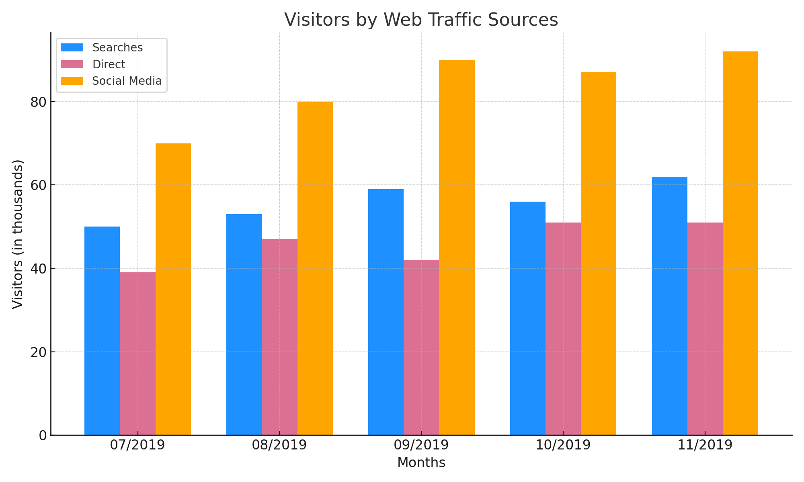

# Web Traffic Sources Visualization

This project generates a bar chart to visualize website visitors by source (Searches, Direct, Social Media) over a five-month period using Python.

## 📊 Data

- Months: July 2019 to November 2019
- Traffic sources:
  - Searches
  - Direct
  - Social Media

## 🛠️ Requirements

```bash
pip install matplotlib numpy
```

## ▶️ How to Run

```bash
python web_traffic_sources.py
```

This will generate and save the bar chart as `traffic_sources_plot.png`.

## 📷 Sample Output


